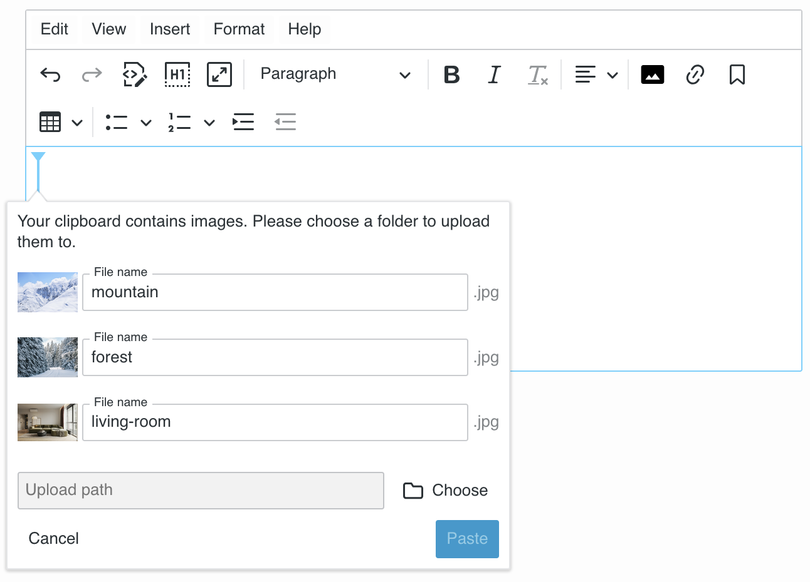

# Happy Paste

A Jahia module to paste content happily in rich texts:

- Automatically remove formatting while preserving basic structure when pasting from Microsoft Word, Google Docs and similar rich text editors.
- Extract images from the pasted content and upload them to the media library.

## Installation

This package is currently under development and not yet published to the Jahia store. You can download snapshots built from the `main` branch:

- Go to the [list of Build runs](https://github.com/Jahia/happy-paste/actions?query=is%3Asuccess+branch%3Amain)
- Pick the latest successful build
- Download the `happy-paste-<version>.tgz` artifact
